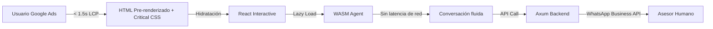
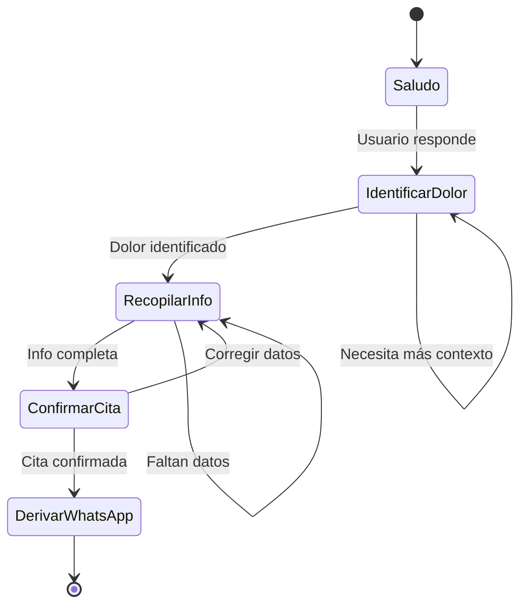
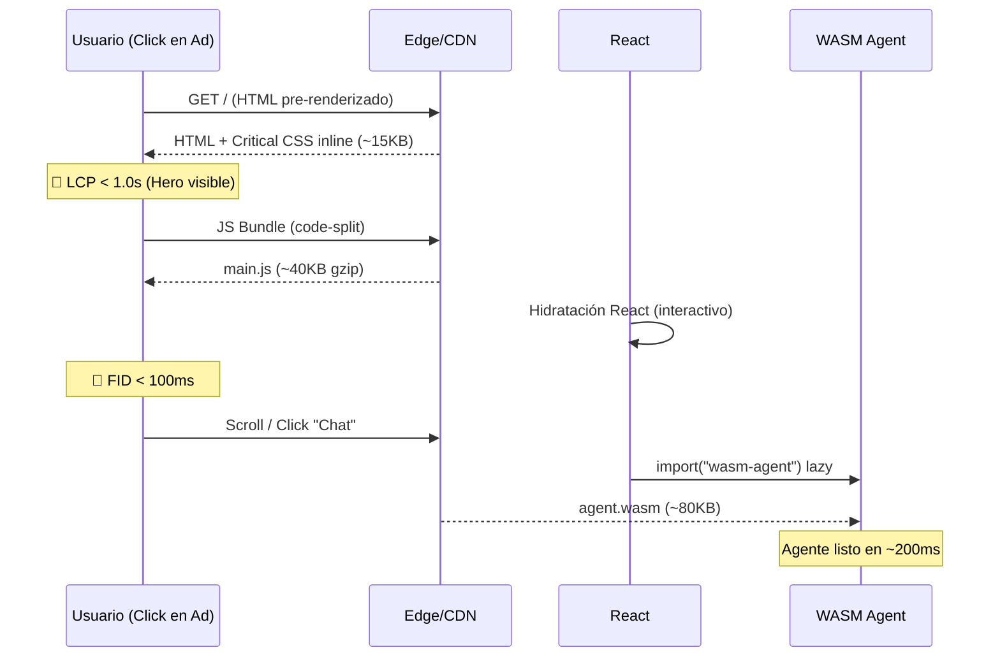

# 🏛️ Methodius Tech — Landing Page: Plan de Arquitectura

> **Objetivo:** Crear una landing page vitrina de alto rendimiento que compita en subastas de Google Ads, con un agente conversacional integrado que cualifique leads y agende citas de asesoría técnica vía WhatsApp.

---

## 1. Stack Tecnológico

| Capa | Tecnología | Justificación |
|------|-----------|---------------|
| **Frontend** | React 19 + Vite 6 | Hidratación selectiva, bundle splitting, pre-rendering SSG |
| **Agente WASM** | Rust → WebAssembly (wasm-pack) | Lógica conversacional client-side sin latencia de red |
| **Backend API** | Rust (Axum) | Endpoints para WhatsApp Business API, leads, citas |
| **Estilos** | Vanilla CSS + CSS Modules | Control total, zero-runtime, critical CSS inline |
| **Despliegue** | Cloudflare Pages + Workers | Edge rendering, cache agresivo, latencia mínima |

### ¿Por qué React + Rust?



- **Rust WASM**: El agente conversacional corre 100% en el navegador. Árbol de decisiones, validación de datos y flujo de conversación sin roundtrips al servidor.
- **Axum Backend**: Solo se invoca para persistir leads y disparar mensajes de WhatsApp.
- **React**: UI declarativa con hidratación progresiva — solo se carga JS de secciones visibles.

---

## 2. Estructura de Archivos

```
portaMethodius/
│
├── frontend/                       # React + Vite
│   ├── public/
│   │   ├── favicon.svg
│   │   ├── og-image.webp           # Open Graph para redes
│   │   └── robots.txt
│   ├── src/
│   │   ├── assets/                 # Imágenes optimizadas WebP/AVIF
│   │   │   ├── hero-bg.webp
│   │   │   ├── logo-methodius.svg
│   │   │   └── products/
│   │   ├── styles/
│   │   │   ├── global.css          # Reset, variables CSS, tipografía
│   │   │   ├── animations.css      # Keyframes reutilizables
│   │   │   └── components/         # CSS Modules por componente
│   │   ├── components/
│   │   │   ├── Layout/
│   │   │   │   ├── Navbar.jsx      # Sticky nav + CTA flotante
│   │   │   │   ├── Footer.jsx
│   │   │   │   └── FloatingCTA.jsx # Botón WhatsApp + Chat
│   │   │   ├── Hero/
│   │   │   │   └── Hero.jsx        # Sección principal con headline
│   │   │   ├── Services/
│   │   │   │   └── Services.jsx    # Tarjetas de servicios
│   │   │   ├── Products/
│   │   │   │   ├── ProductGrid.jsx # Grid vitrina de productos
│   │   │   │   └── ProductCard.jsx # Card individual
│   │   │   ├── Methodology/
│   │   │   │   └── Methodology.jsx # Las 3 fases: Diagnóstico → Arquitectura → Control
│   │   │   ├── Testimonials/
│   │   │   │   └── Testimonials.jsx
│   │   │   ├── ChatAgent/
│   │   │   │   ├── ChatWidget.jsx  # Widget flotante estilo WhatsApp
│   │   │   │   ├── ChatBubble.jsx  # Burbuja individual
│   │   │   │   ├── ChatInput.jsx   # Input del usuario
│   │   │   │   └── useAgent.js     # Hook que conecta con WASM
│   │   │   └── common/
│   │   │       ├── Button.jsx
│   │   │       ├── SectionTitle.jsx
│   │   │       └── ScrollReveal.jsx # Animaciones on-scroll
│   │   ├── hooks/
│   │   │   ├── useIntersection.js  # Lazy loading de secciones
│   │   │   └── useWasm.js          # Carga asíncrona del módulo WASM
│   │   ├── utils/
│   │   │   ├── whatsapp.js         # Generador de deep links WA
│   │   │   └── analytics.js        # Tracking de conversiones
│   │   ├── App.jsx
│   │   ├── main.jsx
│   │   └── index.html
│   ├── vite.config.js
│   └── package.json
│
├── wasm-agent/                     # Rust → WebAssembly
│   ├── src/
│   │   ├── lib.rs                  # Entry point, #[wasm_bindgen]
│   │   ├── conversation.rs         # Máquina de estados del flujo
│   │   ├── intent.rs               # Detección de intención (keyword matching)
│   │   ├── responses.rs            # Banco de respuestas por estado
│   │   └── models.rs               # Structs: Lead, Appointment, PainPoint
│   ├── Cargo.toml
│   ├── build.sh                    # wasm-pack build --target web
│   └── pkg/                        # Output compilado (auto-generado)
│
├── backend/                        # Rust (Axum)
│   ├── src/
│   │   ├── main.rs                 # Server Axum + CORS
│   │   ├── routes/
│   │   │   ├── mod.rs
│   │   │   ├── leads.rs            # POST /api/leads
│   │   │   ├── appointments.rs     # POST /api/appointments
│   │   │   └── whatsapp.rs         # POST /api/whatsapp/send
│   │   ├── services/
│   │   │   ├── whatsapp_service.rs # Integración WhatsApp Business API
│   │   │   └── calendar_service.rs # Gestión de disponibilidad
│   │   ├── models/
│   │   │   ├── lead.rs
│   │   │   └── appointment.rs
│   │   └── config.rs               # Variables de entorno
│   ├── Cargo.toml
│   └── .env.example
│
├── Cargo.toml                      # Workspace (wasm-agent + backend)
└── README.md
```

---

## 3. Secciones de la Landing Page

### 3.1 Navbar (Sticky)
- Logo Methodius a la izquierda
- Links: Servicios | Productos | Metodología | Contacto
- **CTA primario**: `"Agenda tu Diagnóstico Gratis"` → abre chat agent
- Se comprime a hamburger en mobile

### 3.2 Hero
- **Headline**: *"Adiós al Caos Operativo. Bienvenido al Sistema."*
- **Subheadline**: *"Construimos la infraestructura digital que tu empresa necesita para escalar."*
- Fondo con gradiente Navy → Cian animado (mesh gradient sutil)
- **2 CTAs**: `"Ver Soluciones"` (scroll) + `"Hablar con un Asesor"` (abre chat)
- Animación de partículas o grid que se ordena (representando caos → sistema)

### 3.3 Servicios / Propuesta de Valor
- 3 cards representando las fases:
  1. 🔍 **Diagnóstico** — *"Identificamos los cuellos de botella"*
  2. 🏗️ **Arquitectura** — *"Diseñamos el sistema a tu medida"*
  3. 🎯 **Control** — *"Automatizamos y monitoreamos"*
- Cada card con hover effect (glassmorphism + elevación)
- Icono animado en cada card

### 3.4 Productos / Vitrina
- Grid responsive (3 cols desktop, 1 col mobile)
- Cada `ProductCard` muestra:
  - Screenshot/mockup del producto
  - Nombre + tagline corto
  - Tags de tecnología
  - Botón `"Más Info"` → abre chat con contexto del producto
- Productos a mostrar (ejemplo):
  - **Sistema de Gestión Naval** — ODTs, bitácoras, trazabilidad
  - **Automatización con IA** — SOPs convertidos en prompts
  - **Dashboards Operativos** — Métricas en tiempo real
  - **Desarrollo a Medida** — Apps web y móviles

### 3.5 Metodología (Timeline Visual)
- Timeline horizontal (desktop) / vertical (mobile)
- 3 nodos con animación secuencial on-scroll
- Conecta visualmente Diagnóstico → Arquitectura → Control

### 3.6 Testimonios / Casos de Éxito
- Carousel con testimonios
- Foto + nombre + empresa + quote
- Auto-slide con pause on hover

### 3.7 Footer
- Links rápidos, redes sociales
- Dirección, teléfono, email
- Badge "Powered by Rust 🦀"

### 3.8 Elementos Flotantes (siempre visibles)
- **Botón WhatsApp** (esquina inferior derecha) — verde WA
- **Chat Widget** — se expande desde el botón
- **Barra CTA mobile** — fija en bottom con `"Agenda tu Cita"`

---

## 4. Agente Conversacional (WASM)

### 4.1 Flujo de Estados



### 4.2 Estados del Agente

| Estado | Objetivo | Datos recopilados |
|--------|----------|-------------------|
| **Saludo** | Bienvenida cálida, generar rapport | — |
| **IdentificarDolor** | Detectar pain points del prospecto | `pain_points[]` |
| **RecopilarInfo** | Nombre, empresa, cargo, tamaño, industria | `lead{}` |
| **ConfirmarCita** | Proponer horario, confirmar datos | `appointment{}` |
| **DerivarWhatsApp** | Generar deep link WA con resumen pre-cargado | — |

### 4.3 Ejemplo de Conversación

```
🤖 ¡Hola! Soy el asistente de Methodius Tech. 👋
   Estoy aquí para ayudarte a encontrar la solución
   perfecta para tu empresa. ¿Qué te trae por aquí?

   [ Quiero automatizar procesos ]
   [ Necesito un sistema a medida ]
   [ Tengo problemas operativos ]
   [ Solo estoy explorando ]

👤 Tengo problemas operativos

🤖 Entiendo perfectamente. El caos operativo es más
   común de lo que parece y tiene solución. 💡
   ¿Podrías contarme un poco más?
   
   [ Información desorganizada ]
   [ Procesos manuales repetitivos ]
   [ Falta de visibilidad/métricas ]
   [ Dificultad para escalar ]

👤 Procesos manuales repetitivos

🤖 ¡Ese es justo nuestro fuerte! Hemos ayudado a
   empresas a reducir hasta un 70% el tiempo en tareas
   repetitivas. Para conectarte con un asesor
   especializado, necesito algunos datos:
   
   ¿Cuál es tu nombre?

👤 Carlos Mendoza

🤖 ¡Mucho gusto, Carlos! ¿De qué empresa vienes
   y cuál es tu cargo?

   ... (continúa recopilación) ...

🤖 Perfecto Carlos. Resumo tu solicitud:
   📋 Nombre: Carlos Mendoza
   🏢 Empresa: LogiMax Solutions
   🎯 Dolor: Procesos manuales repetitivos
   📅 Cita propuesta: Martes 20, 10:00 AM
   
   ¿Todo correcto?

   [ ✅ Sí, confirmar ] [ ✏️ Corregir datos ]

👤 ✅ Sí, confirmar

🤖 ¡Excelente! Tu cita ha sido agendada. 🎉
   Te voy a conectar con nuestro equipo por WhatsApp
   para que tengas un canal directo.
   
   [ 💬 Ir a WhatsApp ]
```

### 4.4 Deep Link WhatsApp

El agente genera un link con mensaje pre-cargado:

```
https://wa.me/58XXXXXXXXXX?text=Hola%20Methodius!%20Soy%20Carlos%20Mendoza%20
de%20LogiMax%20Solutions.%20Tengo%20una%20cita%20agendada%20para%20el%20
Martes%2020%20a%20las%2010AM.%20Mi%20consulta%20es%20sobre%20
automatización%20de%20procesos%20manuales.
```

---

## 5. Estrategia de Rendimiento (Google Ads)

> **Meta**: LCP < 1.5s · FID < 100ms · CLS < 0.05

### 5.1 Carga Progresiva



### 5.2 Técnicas Clave

| Técnica | Implementación |
|---------|---------------|
| **Pre-rendering SSG** | `vite-plugin-ssr` genera HTML estático en build |
| **Critical CSS Inline** | CSS del Hero/Navbar embebido en `<head>` |
| **Code Splitting** | Cada sección = chunk separado, cargado con `IntersectionObserver` |
| **WASM Lazy Load** | El agente se carga solo al interactuar con el chat |
| **Imágenes** | WebP con `<picture>` + `loading="lazy"` + dimensiones explícitas |
| **Fonts** | `font-display: swap` + preload de Inter (variable) |
| **Preconnect** | `<link rel="preconnect">` a CDN, WA API, fonts |

---

## 6. Sistema de Diseño

### 6.1 Paleta de Colores

```css
:root {
  /* Primarios */
  --navy:        hsl(220, 45%, 12%);    /* Fondo principal */
  --navy-light:  hsl(220, 40%, 18%);    /* Cards, elevaciones */
  --steel:       hsl(220, 15%, 40%);    /* Texto secundario */
  
  /* Acentos */
  --cyan:        hsl(185, 85%, 55%);    /* CTA, highlights tech */
  --cyan-glow:   hsl(185, 85%, 55%, 0.3); /* Sombras luminosas */
  --green-wa:    hsl(142, 70%, 45%);    /* Botón WhatsApp */
  
  /* Neutros */
  --white:       hsl(0, 0%, 98%);
  --white-muted: hsl(220, 15%, 75%);
  
  /* Gradientes */
  --gradient-hero: linear-gradient(135deg, var(--navy) 0%, hsl(200, 50%, 15%) 100%);
  --gradient-cta:  linear-gradient(135deg, var(--cyan) 0%, hsl(200, 80%, 50%) 100%);
  
  /* Glassmorphism */
  --glass-bg:    hsl(220, 40%, 18%, 0.6);
  --glass-blur:  blur(20px);
  --glass-border: 1px solid hsl(220, 40%, 30%, 0.3);
}
```

### 6.2 Tipografía

```css
/* Google Fonts: Inter (variable) */
--font-display: 'Inter', system-ui, sans-serif;
--font-mono:    'JetBrains Mono', monospace;

--text-xs:   clamp(0.75rem, 0.7rem + 0.25vw, 0.875rem);
--text-sm:   clamp(0.875rem, 0.8rem + 0.35vw, 1rem);
--text-base: clamp(1rem, 0.9rem + 0.5vw, 1.125rem);
--text-lg:   clamp(1.25rem, 1.1rem + 0.75vw, 1.5rem);
--text-xl:   clamp(1.5rem, 1.2rem + 1.5vw, 2.25rem);
--text-hero: clamp(2rem, 1.5rem + 2.5vw, 3.5rem);
```

### 6.3 Animaciones

- **Reveal on scroll**: Fade-up con `IntersectionObserver` (60fps, CSS transform only)
- **Hero**: Mesh gradient animado con `@keyframes` (GPU-accelerated)
- **Cards hover**: `scale(1.02)` + `box-shadow` glow cyan
- **Chat widget**: Spring animation al abrir/cerrar
- **CTA pulse**: Glow pulsante sutil en botón WhatsApp

---

## 7. Plan de Desarrollo por Fases

### Fase 1 — Fundación (Actual)
- [x] Definir identidad visual y arquitectura
- [ ] Inicializar proyecto React + Vite
- [ ] Configurar Rust workspace (wasm-agent + backend)
- [ ] Implementar sistema de diseño (CSS variables, reset, tipografía)
- [ ] Crear componentes base (Button, SectionTitle, Layout)

### Fase 2 — Landing Estática
- [ ] Desarrollar Hero con animación de fondo
- [ ] Implementar sección de Servicios (3 fases)
- [ ] Crear ProductGrid + ProductCard con datos estáticos
- [ ] Sección de Metodología (timeline animado)
- [ ] Navbar sticky + responsive
- [ ] Footer
- [ ] Optimizar imágenes y fuentes

### Fase 3 — Agente Conversacional
- [ ] Desarrollar máquina de estados en Rust (conversation.rs)
- [ ] Compilar a WASM con wasm-pack
- [ ] Crear ChatWidget + ChatBubble + ChatInput en React
- [ ] Integrar useAgent hook con módulo WASM
- [ ] Implementar flujo completo: Saludo → Dolor → Info → Cita → WhatsApp
- [ ] Generar deep links de WhatsApp con contexto

### Fase 4 — Backend + Integraciones
- [ ] Servidor Axum con endpoints REST
- [ ] Integración WhatsApp Business API
- [ ] Persistencia de leads (SQLite/PostgreSQL)
- [ ] Sistema de calendario para disponibilidad de citas
- [ ] Webhook para notificaciones

### Fase 5 — Optimización + Despliegue
- [ ] Pre-rendering SSG con Vite
- [ ] Critical CSS inline
- [ ] Auditoría Lighthouse (target: 95+ Performance)
- [ ] Testing E2E del flujo de conversión
- [ ] Despliegue a Cloudflare Pages + Workers
- [ ] Configuración de Google Ads tracking (gtag conversiones)

---

## 8. Dependencias Clave

### Frontend (package.json)
```json
{
  "dependencies": {
    "react": "^19.0.0",
    "react-dom": "^19.0.0"
  },
  "devDependencies": {
    "vite": "^6.0.0",
    "@vitejs/plugin-react": "^4.0.0",
    "vite-plugin-ssr": "^0.4.0"
  }
}
```

### Rust Workspace (Cargo.toml)
```toml
[workspace]
members = ["wasm-agent", "backend"]

[workspace.dependencies]
serde = { version = "1", features = ["derive"] }
serde_json = "1"
```

### WASM Agent (wasm-agent/Cargo.toml)
```toml
[lib]
crate-type = ["cdylib"]

[dependencies]
wasm-bindgen = "0.2"
serde = { workspace = true }
serde_json = { workspace = true }
js-sys = "0.3"
```

### Backend (backend/Cargo.toml)
```toml
[dependencies]
axum = "0.8"
tokio = { version = "1", features = ["full"] }
serde = { workspace = true }
serde_json = { workspace = true }
reqwest = { version = "0.12", features = ["json"] }
tower-http = { version = "0.6", features = ["cors"] }
dotenvy = "0.15"
```

---

> [!IMPORTANT]
> **Próximo paso**: Una vez aprobada esta estructura, procederemos a ejecutar la **Fase 1** — inicializar los proyectos, configurar el workspace de Rust y crear el sistema de diseño CSS.
